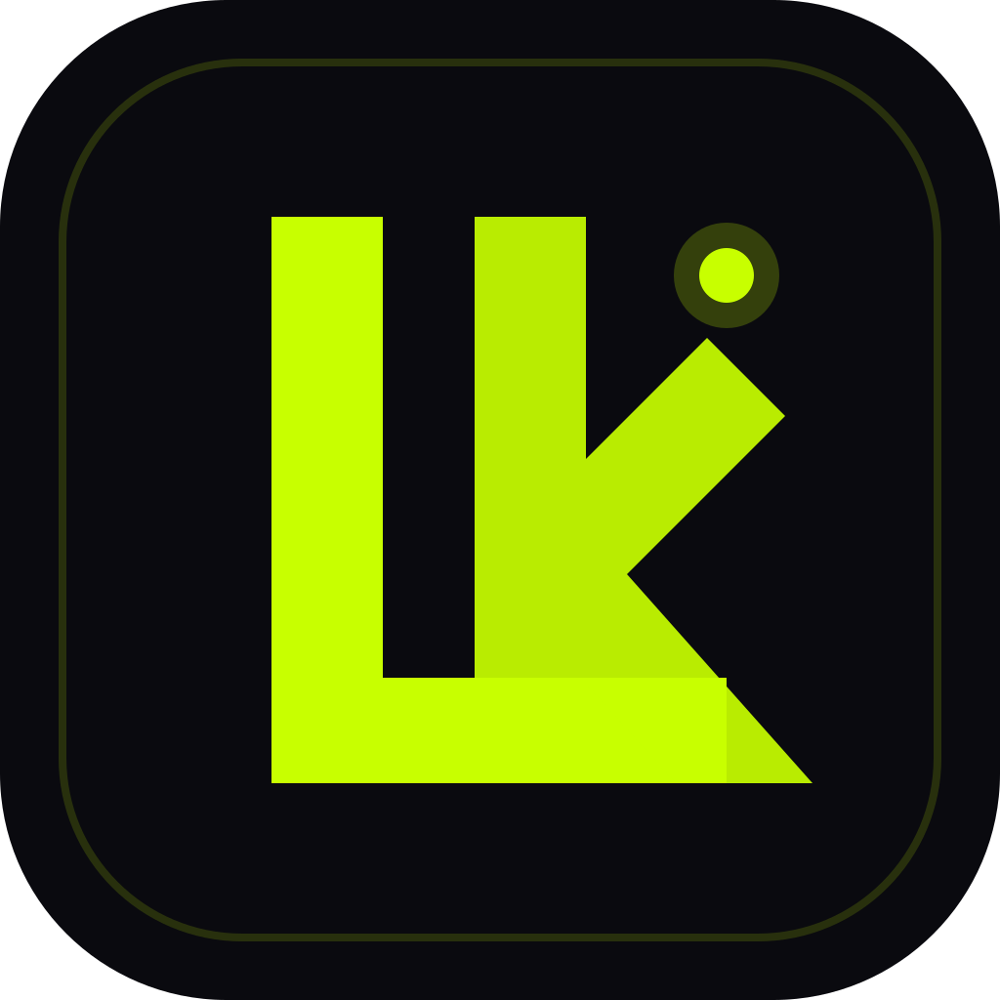

# Lumiere



Lumiere is a native macOS 15+ screenshot polish and annotation app for turning clipboard screenshots into clean, exportable visuals. It watches for copied images, applies local image cleanup, provides annotation controls, and exports PNG/JPEG/HEIC without network or backend dependencies.

## Status

- Platform: macOS 15.0+
- Stack: Swift 6, SwiftUI, AppKit, Combine, SwiftData, Core Image/Vision/Core ML framework APIs
- Build: verified locally with Xcode Debug build
- Tests: Xcode unit-test target included and verified locally
- Distribution: source-ready for private GitHub; GitHub Actions workflow included
- Release signing/notarization: not configured yet

## Highlights

- Native dark macOS UI with NODAYSIDLE Volt accent `#C8FF00`
- Floating `NSPanel` toolbar with polished glass styling
- Clipboard image monitoring with duplicate debounce
- Local image processing for shadow styling and perspective correction controls
- Vector annotation tools for arrows, rectangles, text, and callouts
- Export to PNG, JPEG, and HEIC
- Local-only settings persistence

## Requirements

- macOS 15.0+
- Xcode 16+ / Swift 6+

## Project Structure

```text
Lumiere/
  Core/       logging, orchestration, services, theme
  Features/   settings and screenshot UI
  Models/     annotations, image processing, settings models
  Resources/  app icons and brand assets
```

Important files:

- `Lumiere/LumiereApp.swift` — app entry point
- `Lumiere/ContentView.swift` — root view
- `Lumiere/Core/MainViewModel.swift` — workflow orchestration
- `Lumiere/Core/Services/ClipboardMonitorService.swift` — pasteboard image monitoring
- `Lumiere/Core/Services/ImageProcessingPipeline.swift` — image cleanup pipeline
- `Lumiere/Core/Services/CoreMLInferenceService.swift` — local heuristic/Core ML wrapper
- `Lumiere/Core/Services/AnnotationRenderingService.swift` — export rendering
- `Lumiere/Features/UI/Services/PanelManager.swift` — floating panel lifecycle
- `Lumiere/Resources/Assets.xcassets/AppIcon.appiconset/` — bundled app icon assets
- `Lumiere/Resources/Brand/LumiereLogo.svg` — source logo
- `.github/workflows/build.yml` — GitHub Actions Debug build workflow

## Test Locally

```bash
xcodebuild \
  -project Lumiere.xcodeproj \
  -scheme Lumiere \
  -destination 'platform=macOS' \
  -derivedDataPath build/TestDerivedData \
  test
```

## Build Locally

```bash
xcodebuild \
  -project Lumiere.xcodeproj \
  -scheme Lumiere \
  -configuration Debug \
  -derivedDataPath build/DerivedData \
  clean build
```

Built app path:

```text
build/DerivedData/Build/Products/Debug/Lumiere.app
```

Verify local signature:

```bash
codesign --verify --deep --strict --verbose=2 build/DerivedData/Build/Products/Debug/Lumiere.app
```

## Install Locally

After a successful build:

```bash
ditto build/DerivedData/Build/Products/Debug/Lumiere.app /Applications/Lumiere.app
```

## GitHub Actions

The included workflow runs on `macos-15` and performs:

1. Xcode version printout
2. unit tests
3. Debug build
4. code signature verification
5. Debug `.app` zip packaging
6. artifact upload

No GitHub Release is created by the workflow.

## Current Known Gaps

- Release signing/notarization/DMG distribution is not configured yet.
- Core ML behavior is currently a local heuristic wrapper unless real `.mlmodel` assets are added later.
- Clipboard-monitor restart behavior still needs full runtime smoke coverage.
- Annotation preview/export alignment still needs visual smoke coverage.

## Non-Goals

- No backend.
- No cloud processing.
- No telemetry.
- No cross-platform rewrite.
- No third-party model download dependency.
